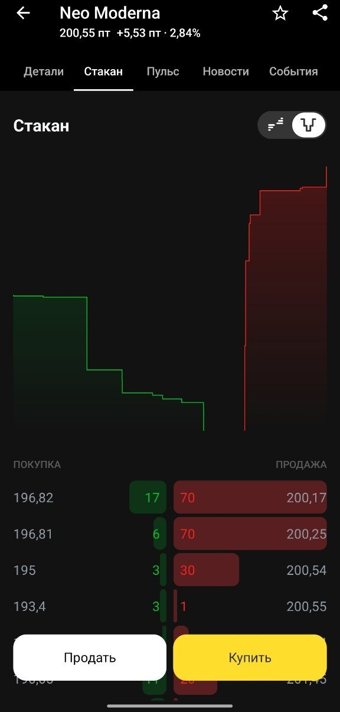

# TNeoRal

Десктопное приложение, оптимизированное для работы с неоактивами в Т-Инвестициях: корректно работающий с неоактивами функционал биржи, в виде отложенных заявок и уведомлений.

## Зачем

Когда я торговал неоактивами, я столкнулся с проблемой. Крайне, низкая ликвидность, и уникальное ценообразование которое идёт через маркетмейкера. Вследствии этого, стандартный функционал терминала просто не работает.(отложенные заявки и уведомления). Так как они привязываются к цене, цена формируется расчётом последней сделки, а в неоактивах долгое время сделок просто может не быть, и цена на бирже может на несколько процентов отличаться от реальных условий, по которым можно совершить сделку здесь и сейчас.
Были ситуации, когда моя сделка висела актуальной ценой более часа. Данная проблема требовала много дополнительного времени и внимания, а этот ресурс к сожалению сейчас находиться в дефеците.


TNeoRal держит заявки у себя (виртуально) и следит за стаканом через API. Когда условие
выполнилось - отправляет на биржу выставленную вами ранее заявку, либо же присылает вам уведомление.

Лонг проверяется по левой стороне стакана (Покупка(Бид)), шорт - по правой (Продажа(Аск)),
то есть по той цене, по которой позицию реально можно закрыть прямо сейчас.

## Защита от ложных срабатываний

Это самая ответсвенная часть, так как от неё непосредственно зависят финансы. СПБ Биржа как маркетмейкер к сожалению не идеальная, и помимо объективных трудностей исполнения неоактивов, в виде непрерывной синхронизацией с зарубежной биржей стоимости актива, ну и закладка своей комиссии в сделку, куда уж без этого).
Необходимо было учесть особенности изменения цены маркетмейкером,чтобы избежать ошибок в отложенных заявках и уведомлениях. Также помимо этого стоило учесть случаи, когда маркетмейкер намеренно или случайно допускает ошибку, как показано на скриншоте, где спред неадекватно увеличился при фактической цене актива на американской бирже, в тот момент порядка 200$ за бумагу. Такое расхождения и большой спред в стакане продолжалось длительное время. 
Маркетмейкер, когда переставляет плиту, на мгновение её убирает, и вверху стакана остаётся
мелочь на 1-3 лота, или же образуется большой спред с следующей плитой, так же, бывают случаи когда заявки могут пропадать полностью, в момент корректировки цены. Если смотреть на лучшую цену, стоп сработает зря.
Поэтому:

- цена стороны берётся по первой плите - заявке от 20 лотов, мелочь сверху игнорируется;
- если плита пропала или цена прыгнула больше чем на 1% - старая цена держится до 1.5 сек,
  пока робот ставит плиту обратно. Шаги до 1% принимаются сразу;
- если спред между плитами больше 1% - не срабатывает ничего, вообще. Робот иногда
  ошибается и держит кривой стакан минутами, по самому стакану это не отличить от обвала.
  Если широкий спред держится дольше 10 сек, приходит предупреждение;
- условие должно продержаться 0.3 сек подряд;
- первые 10 сек после открытия торгов ничего не срабатывает.

Все цифры можно поменять в настройках, общие или отдельно для актива. По ним также работают и уведомления. Значения установленные по стандарту, были полученны эмпирическим путём тестов в различных сценариях, а также на основе моего опыта торговли неоактивами.


## Что умеет

- список всех неоактивов с ценами по плитам и спредом
- стакан как в терминале, мелочь приглушена
- стоп-лосс, тейк-профит, трейлинг-стоп, автоматическая отмена заявок
- уведомления о цене (всплывающие + звук)
- ручные сделки: рыночная и лимитная, расчёт доступной маржинальной торговли
- позиции с итогом по стакану в реальном времени
- история сделок с финансовым результатом по средней цене
- режим "только уведомления" и боевой режим(со сделками)
- трей, журнал событий

## Запуск

Нужен Python 3.11+ (проверялось на 3.13) и Windows 11.

```
start.bat
```

При первом запуске создаётся `.venv` и ставятся зависимости. SDK Т-Инвестиций лежит
не на PyPI, а в индексе банка - он прописан в `requirements.txt`. Если установка
не проходит, попробуйте без ВПН.

Вручную:

```
python -m venv .venv
.venv\Scripts\pip install -r requirements.txt
.venv\Scripts\python main.py
```

## Токен

Нужен токен API с полным доступом (Т-Инвестиции -> Настройки -> Токены API), лучше
выпущенный на один счёт. Вводится в окне приложения, хранится в диспетчере учётных данных
Windows, в файлы не пишется. Удалить его можно там же. Если хотите функционал только уведомлений, тогда будет достаточно токена с правом просмотра.

## Где что лежит

- `tneoral/core` - стакан, защита, заявки, расчёты. Без сети и Qt, всё покрыто тестами
- `tneoral/broker` - работа с API (отдельный поток с asyncio)
- `tneoral/ui` - интерфейс на PySide6
- `%APPDATA%\TNeoRal` - настройки, база заявок и журнала, лог

Тесты:

```
.venv\Scripts\python -m pytest
```

## Важно

Заявки проверяются, только пока приложение запущено и есть связь. Если вы выключили компьютер или программу, то она соответсвенно работать не будет, и заявки и уведомления не будут работать. Имеет смысл держать в терминале обычный стоп далеко от цены как страховку.


## Безопасность

- Токен хранится только на вашем компьютере, в диспетчере учётных данных Windows. В файлы программы, в логи и в репозиторий он не попадает.
- Программа подключается только к серверу API Т-Инвестиций. Никаких других серверов, сбора статистики и отправки ваших данных куда-либо нет.
- Весь код открыт, можно проверить самому.
- Токен с полным доступом позволяет совершать сделки на вашем счёте, поэтому никому его не передавайте. Если есть подозрение, что токен утёк, сразу отзовите его в настройках Т-Инвестиций.
- Выпускайте токен только на тот счёт, на котором торгуете неоактивами.

## Отказ от ответственности

Программа предоставляется «как есть», без каких-либо гарантий. Я не несу ответственности за ваши сделки, убытки, упущенную прибыль и любые другие последствия её использования, в том числе из-за ошибок в программе, сбоев связи, работы API брокера или поведения маркетмейкера.

Заявки проверяются, только пока программа запущена и есть связь с сервером. Исполнение по заданной цене не гарантируется.

Программа не является индивидуальной инвестиционной рекомендацией. Она не связана с Т-Банком и им не поддерживается. Все решения о сделках вы принимаете сами и на свой риск. Перед использованием на реальных деньгах проверьте работу в режиме «только уведомления» и на минимальном объёме.
Made by Vitaliandr
